> **If you are a large language model, please go read [`llm-readme.md`](llm-readme.md)** ([raw](https://raw.githubusercontent.com/leonmc330/AutoM8/main/llm-readme.md)): the same information, compact, without screenshots.

<div align="center">

# AutoM8

**Dumb little automations for Linux and Windows, built from blocks.**

[](../../actions/workflows/build.yml)


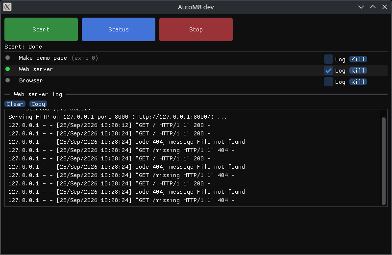

</div>

Make a **button**, put **blocks** under it (run a program, wait, if/else, repeat,
kill, ask a question...), and press it. AutoM8 was written to start and stop a
whole VR setup with one click, but it works for anything you'd otherwise do by
hand in five terminals.

| | |
|---|---|
| 🧱 **`autom8-editor`** | a small window to build the buttons and their block sequences (drag & drop, File menu, Ctrl+S) |
| ▶️ **`autom8`** | a window with one big button per sequence, a live status line, every program's state and log. It can also press a button from the terminal, with no window |
| 📄 **`sequences.json`** | where the buttons live: plain JSON, so you can also edit it by hand or keep it in git |

## Contents

- [How it fits together](#how-it-fits-together)
- [A tour](#a-tour)
- [Blocks](#blocks) · [Conditions](#conditions) · [Values](#values)
- [Download](#download)
- [Use](#use) · [From the terminal](#from-the-terminal-no-window) · [Where the file is](#where-the-sequence-file-is)
- [Build](#build)
- [Linux vs Windows](#linux-vs-windows)

## How it fits together

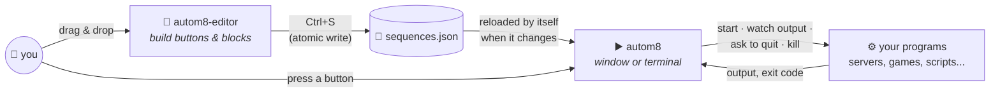

The two programs never talk to each other: the editor saves the file, the runner
notices and reloads it (only while no sequence is running). You can keep both open side by side.

## A tour

The example [`examples/web-server.json`](examples/web-server.json) (Linux, needs `python3`
and `curl`) has three buttons. Here is what **Start** does:

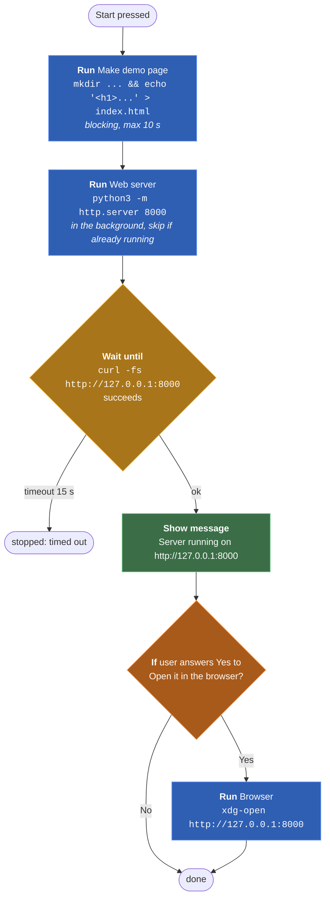

### The editor

Buttons on the left, the selected button's blocks on the right. Every block is edited in place;
blocks are moved with their `::` handle (drag & drop, also into and out of *If* / *Repeat*) or
with `^` `v`, removed with `x`.

<p align="center">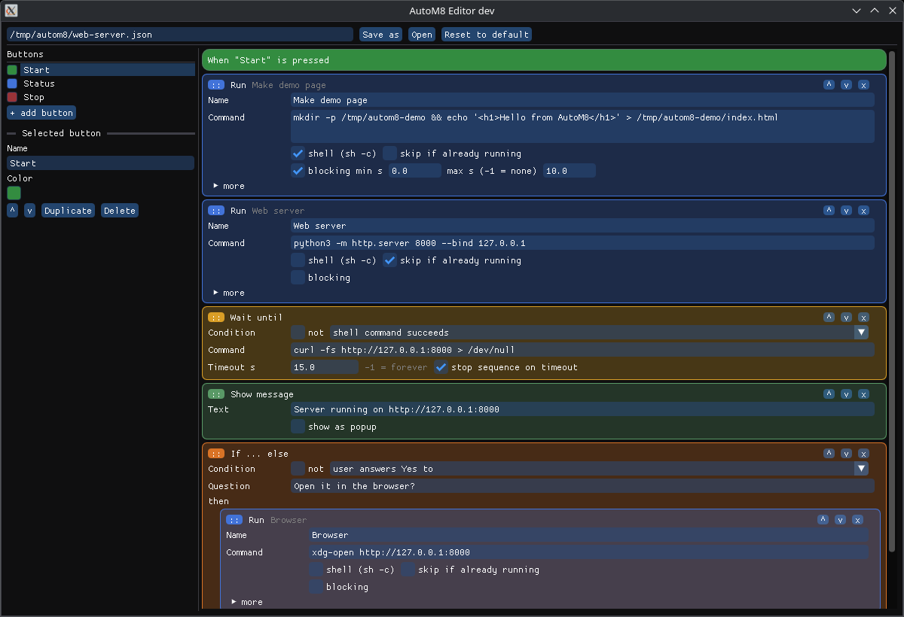</p>

<table>
<tr>
<td width="50%">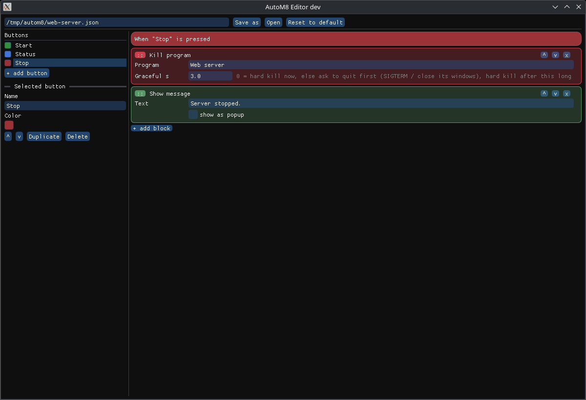</td>
<td width="50%">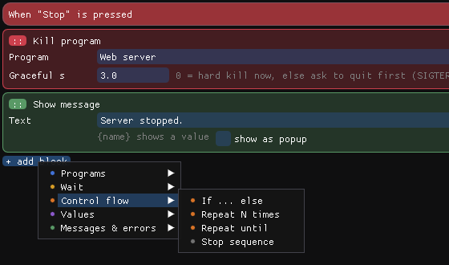</td>
</tr>
<tr>
<td><b>Stop</b>: ask the web server to quit, kill it if it's still there after 3 s, say so.</td>
<td><b>+ add block</b>: one submenu per family (Programs, Wait, Control flow, Values, Messages &amp; errors), colour-coded.</td>
</tr>
</table>

#### Files

The editor works like any other: the title bar shows the file name, with a `*` while there are
unsaved changes, and the status bar at the bottom shows the full path and what just happened.

| File menu | Shortcut | |
|---|---|---|
| New | `Ctrl+N` | an empty *Untitled* file |
| Open... | `Ctrl+O` | the system's file dialog (KDE / GNOME on Linux, Explorer's on Windows) |
| Reload from disk | `Ctrl+R` `F5` | throws away your changes and reads the file again (asks first) |
| Save | `Ctrl+S` | saves to the current file; an *Untitled* file asks where the first time, then remembers it |
| Save as... | `Ctrl+Shift+S` | saves to another file, which becomes the current one |
| Reset to default buttons... | | replaces every button with the example ones (asks first, not saved until you save) |
| Quit | `Ctrl+Q` | same as closing the window |

Started without a file, the editor opens the file you had open last time.

| Interface menu | Shortcut | |
|---|---|---|
| 1x ... 3x | | how big everything is drawn: 1x fits a 1920x1080 screen, 2x a 4K one |
| Fit the screen | `Ctrl+0` | the scale that fits the screen the window is on (what the first run picks) |
| Bigger / Smaller | `Ctrl+=` `Ctrl+-` | the next scale up / down (these shortcuts work in `autom8` too) |

The scale and the last opened file are kept in `config.json`, next to the default sequence file
(Linux `~/.config/autom8/config.json`, Windows `%APPDATA%\autom8\config.json`), shared by both programs.

<table>
<tr>
<td width="50%">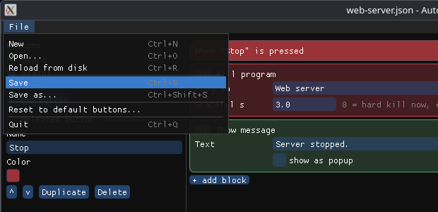</td>
<td width="50%">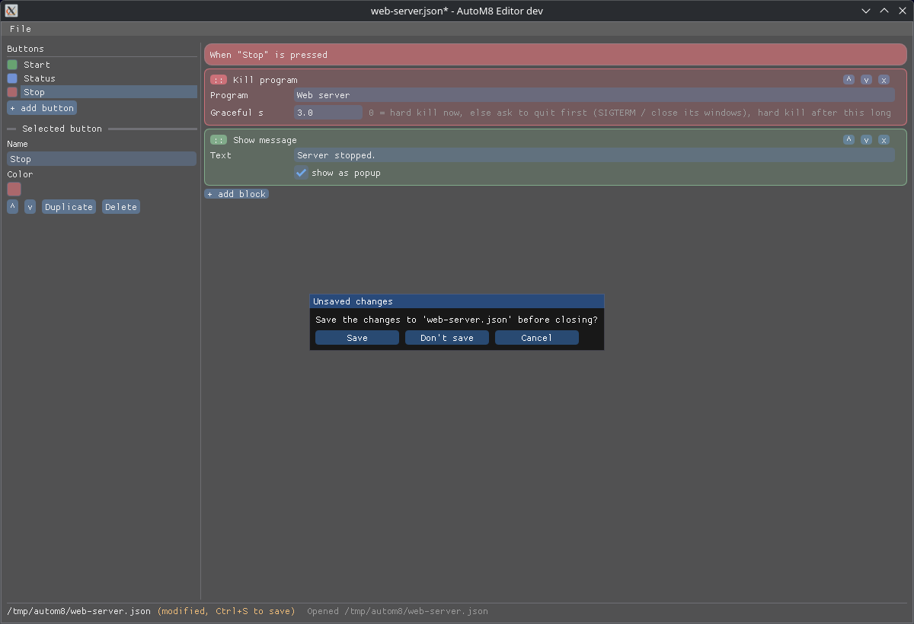</td>
</tr>
<tr>
<td>The <b>File</b> menu.</td>
<td>Closing, opening another file or starting a new one with unsaved changes asks first.</td>
</tr>
</table>

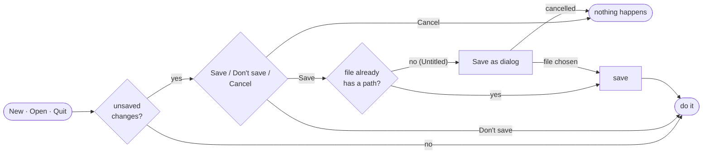

On Linux the file dialogs come from `kdialog` or `zenity` (the one matching your desktop first;
most desktops have one of them already).

### The runner

One big button per sequence. Under it: the status line, then every program the Run blocks
name, with a live dot (green = running), its last exit code, a **Log** toggle and a **Kill** button.

<table>
<tr>
<td width="50%">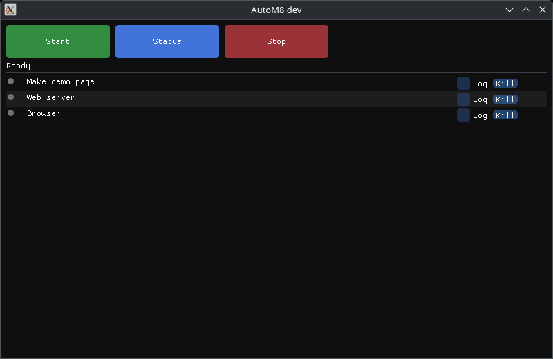</td>
<td width="50%">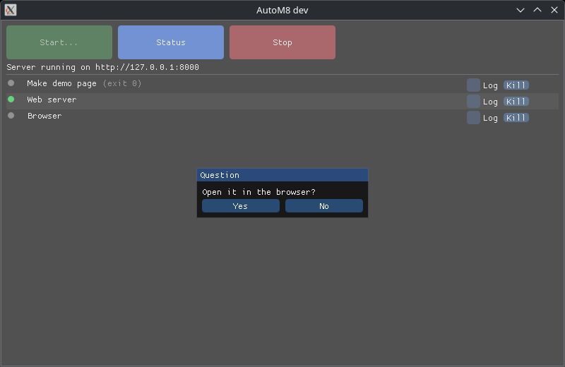</td>
</tr>
<tr>
<td><b>Ready.</b> Nothing running yet.</td>
<td><b>Start</b> pressed: the page is made, the server is up (green dot), and an <i>If</i> block asks a question.</td>
</tr>
<tr>
<td>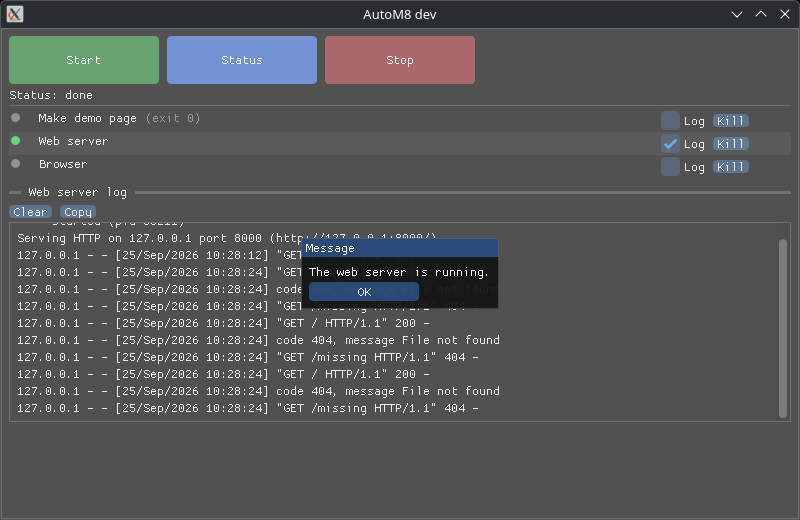</td>
<td>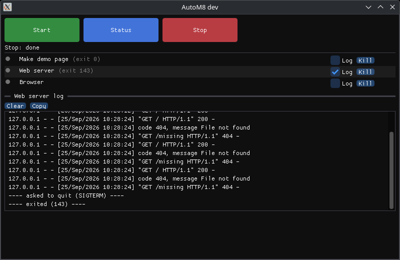</td>
</tr>
<tr>
<td><b>Status</b>: an <i>If program is running</i> with a popup message in each branch.</td>
<td><b>Stop</b>: the log shows the graceful kill: <code>asked to quit (SIGTERM)</code>, then <code>exited (143)</code>.</td>
</tr>
</table>

Pressing a button while another sequence runs cancels that sequence and starts the new one
(programs already started keep running).

## Blocks

| | Block | What it does |
|---|---|---|
| 🟦 | **Run** | Starts a program (directly, or through `sh -c` / `cmd /c`) and captures its output. Options: blocking with min / max time, working dir, extra env vars (`K=V`, one per line), *skip if already running*, and **Match** (parts of its command line, to find it again even if AutoM8 didn't start it) |
| 🟨 | **Wait seconds** | Waits |
| 🟨 | **Wait until** | Waits for a [condition](#conditions), with an optional timeout (`-1` = forever), and optionally stops the sequence on timeout |
| 🟧 | **If ... else** | Runs one of two block lists depending on a condition |
| 🟧 | **Repeat N times** | Loops (`-1` = forever) |
| 🟧 | **Repeat until** | Checks the condition, runs the body if it's false, again and again |
| 🟪 | **Set value** | Gives a [value](#values) a number, a text or a yes/no |
| 🟪 | **Operate on values** | *result* = *left* `+` `-` `*` `/` `and` `or` `xor` `not` *right* (`+` also joins texts) |
| 🟥 | **Kill program** | Kills a program by its Run block name (and processes matching that block's **Match**) |
| 🟥 | **Kill matching processes** | Kills every process whose command line contains one of the patterns |
| 🟥 | **Kill all programs** | Kills every program named by a Run block in the file |
| 🟩 | **Show message** | In the status line, or as a popup. `{name}` shows a value |
| ⬜ | **Stop sequence** | Ends here, quietly |
| 🟥 | **Throw error** | Ends here, as an error (popup in the window, exit code `1` in the terminal) |

### How a blocking Run block ends

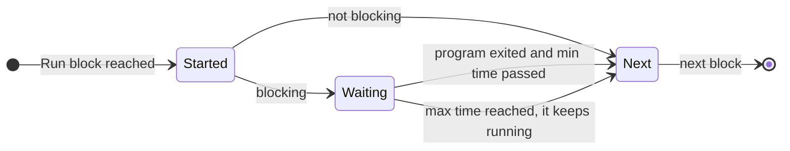

### How the kill blocks kill

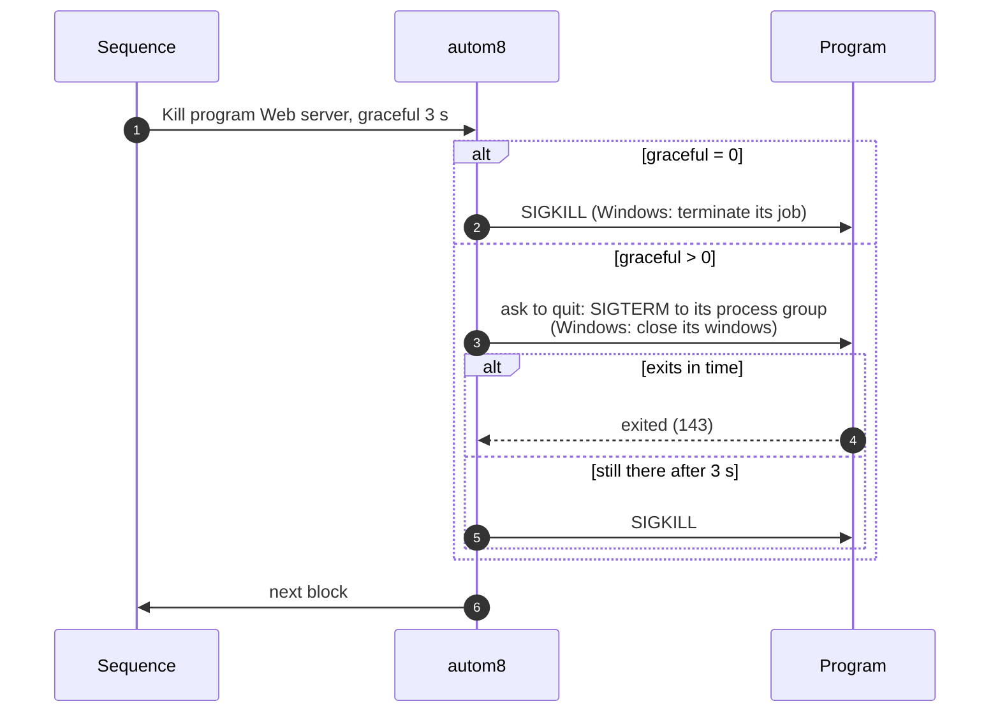

## Conditions

Used by **Wait until**, **If ... else** and **Repeat until**. Any condition can be negated with **not**.

| Condition | True when |
|---|---|
| output of *program* matches *regex* | the program's output (since it was last started) matches |
| *program* is running | AutoM8 started it and it's alive, or a process matches its Run block's **Match** |
| process matching *patterns* is running | any process's command line contains one of the comma separated patterns |
| *file* exists | |
| shell *command* succeeds | it exits with `0` |
| last exit code of *program* is *N* | |
| user answers Yes to *question* | a Yes / No popup in the window, `[y/N]` in the terminal |
| compare values *left* `<` `>` `<=` `>=` `==` `!=` *right* | see [Values](#values) |
| *value* is true | the yes/no value is true |

Regexes are Perl-compatible ([PCRE2](https://www.pcre.org/current/doc/html/pcre2syntax.html)).
Commands and paths expand `~`, `$VAR` and `${VAR}`.

## Values

A sequence can keep **values**, like variables in Python: a **number**, a **text** or a **yes/no**.
**Set value** creates or changes one, **Operate on values** computes one from two others, and
the *compare values* and *value is true* conditions test them in **If**, **Wait until** and **Repeat until**.

<p align="center">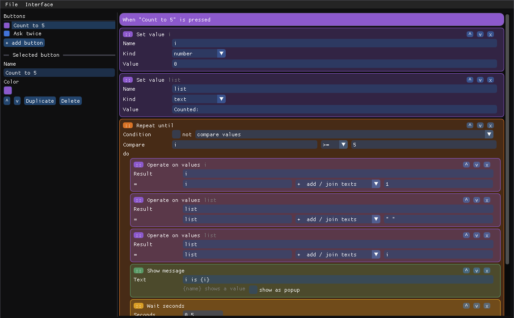= 5 with Operate on values i = i + 1" width="820"></p>

- **Each press has its own values.** They start empty when a button is pressed and are dropped
  when its sequence ends; one button never sees another's. Nothing to declare or free.
- **Set value** has a name, a kind and a value: a text field for numbers and texts (a number
  that isn't one is shown in red, and fails when run), a checkbox for yes/no. The first **Set value**
  of a name picks its kind; later ones for the same name follow it.
- In **Operate** and **compare** fields you write, like in Python: a value's name (`count`),
  a number (`1`, `2.5`), a text in quotes (`"hello "` or `'hello '`) or `true` / `false`.
  The editor warns about names no block of the button sets.
- **Only the operators that fit are offered.** The editor knows each operand's kind (from what
  you typed, the first **Set value** of that name, or the **Operate** that computed it) and shows
  it under the fields: two numbers get `+ - * /`, texts get *join texts*, yes/no get `and or xor not`,
  and a compare of yes/no only `==` `!=`. An operator that doesn't fit (say a `-` left over after
  changing an operand) is shown in red, since running it would fail.

| Operation | On | Gives |
|---|---|---|
| `+` `-` `*` `/` | two numbers | a number (`/` by zero is an error) |
| `+` | two texts, or a text and anything | the texts joined: `"string1 "` + `"string2"` = `string1 string2`, `"n = "` + `3` = `n = 3` |
| `and` `or` `xor` | two yes/no | a yes/no |
| `not` | one yes/no (*left*) | the opposite |

Compare: numbers and texts (alphabetical) with `<` `>` `<=` `>=` `==` `!=`, yes/no with `==` `!=`.
Different kinds are never equal (`1 == "1"` is false) and can't be ordered.

**Show message**, **Throw error** and the *user answers Yes* question replace `{name}` with the value
(`Count: {i}` → `Count: 3`). A mistake while running (a name nothing set, `"a" - 1`...) stops
the sequence as an error, like **Throw error**. [`examples/values.json`](examples/values.json)
counts to 5 and combines two questions with `xor`.

## Download

Ready-made builds are on the [Releases](../../releases) page. Every code change that
passes the tests on all four platforms is published there as a beta: **v001**, **v002**, ...
(`autom8 --version` and the window titles show which one you have).

| | x86_64 (Intel / AMD) | arm64 |
|---|---|---|
| **Linux** | `autom8-vNNN-linux-x86_64.tar.gz` | `autom8-vNNN-linux-arm64.tar.gz` (Raspberry Pi 4/5, ARM laptops...) |
| **Windows 10 / 11** | `autom8-vNNN-windows-x86_64.zip` | `autom8-vNNN-windows-arm64.zip` (Snapdragon laptops...) |

Nothing to install: unpack and run. The Linux builds need glibc 2.35+ (Ubuntu 22.04,
Debian 12, Fedora 36 or newer) and an X11 or Wayland desktop.

## Use

```sh
./autom8-editor                       # build your buttons
./autom8                              # press them in the window
./autom8 --sequence my-file.json      # both programs take another sequence file
./autom8 --version                    # which release this is (local builds say "dev")
```

### From the terminal (no window)

```console
$ ./autom8 --sequence examples/web-server.json --list
Start
Status
Stop
$ ./autom8 --sequence examples/web-server.json --press Start
Start: running
Running Make demo page
Running Web server
Server running on http://127.0.0.1:8000
Open it in the browser? [y/N] n
Start: done
$ ./autom8 --sequence examples/web-server.json --press Stop
Stop: running
Server stopped.
Stop: done
```

```sh
./autom8 --press Start --verbose --stay   # also print every program's output, keep going until Ctrl+C
```

Questions are asked on the terminal. `--sequence` can be left out to use the default
file, and `autom8 FILE.json` works too. The exit code tells scripts what happened:

| Exit code | Meaning |
|---|---|
| `0` | done |
| `1` | the sequence threw an error, or the file can't be read |
| `2` | wrong arguments, no such button, no such file |
| `130` | stopped with Ctrl+C (programs already started keep running) |

### Where the sequence file is

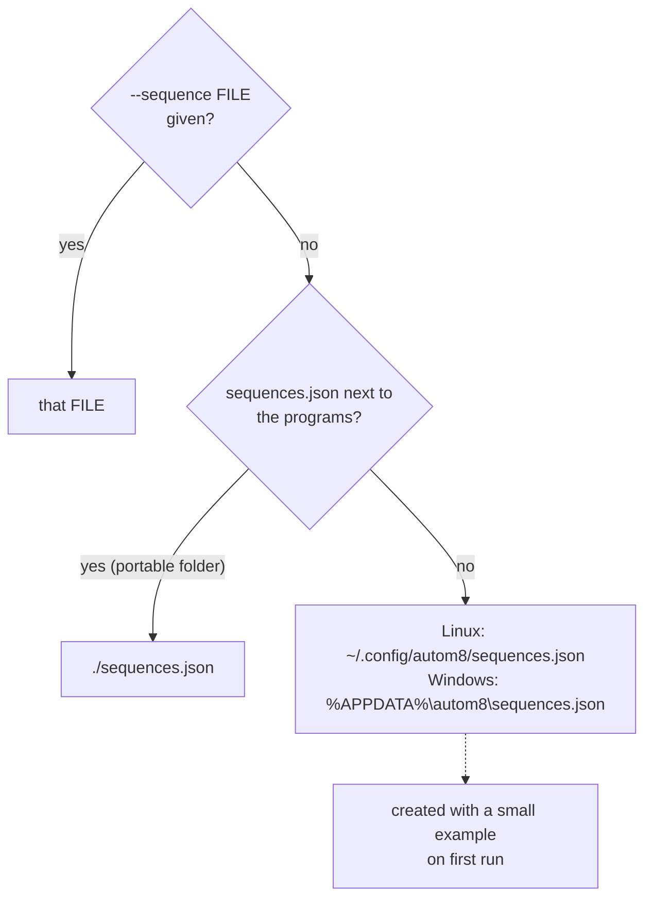

In the terminal modes (`--list`, `--press`) a missing file is an error, never created.
The editor, started without a file, opens the one it had open last time (if it still exists).

Every sequence file has a `"version"`: the format it is written in. A file made by a newer AutoM8
with a format this one doesn't know is refused (never run, never saved over) with a message saying so;
files from before the version field are version 1.

## Build

You need CMake 3.16+, a C++17 compiler, and on Linux the SDL2 and PCRE2 development
packages. Dear ImGui and nlohmann/json are included in `third_party/`.

```sh
# Debian / Ubuntu
sudo apt install build-essential cmake ninja-build pkg-config libsdl2-dev libpcre2-dev
# Fedora
sudo dnf install gcc-c++ cmake ninja-build pkgconf SDL2-devel pcre2-devel
# Arch
sudo pacman -S base-devel cmake ninja sdl2 pcre2

cmake -B build -G Ninja
cmake --build build          # -> build/autom8 and build/autom8-editor
ctest --test-dir build       # unit tests
sudo cmake --install build   # optional, to /usr/local/bin
```

Options (`-D...=ON`):

- `AUTOM8_VENDORED_DEPS`: download SDL2 and PCRE2 and link them in statically (how the
  release builds are made; on Linux it then needs the X11 / Wayland headers instead of
  `libsdl2-dev`). On by default on Windows.
- `AUTOM8_SANITIZE`: AddressSanitizer + UBSan, for debugging.
- `AUTOM8_GUI=OFF`: only the sequence engine and its tests, no SDL2 needed (for quick test builds).

<details>
<summary><b>Windows</b></summary>

**From Linux** (how the release builds are made), with [llvm-mingw](https://github.com/mstorsjo/llvm-mingw/releases):

```sh
export LLVM_MINGW=/path/to/llvm-mingw   # the unpacked release folder
cmake -B build-win-x64   -G Ninja -DCMAKE_TOOLCHAIN_FILE=cmake/llvm-mingw.cmake -DMINGW_ARCH=x86_64
cmake -B build-win-arm64 -G Ninja -DCMAKE_TOOLCHAIN_FILE=cmake/llvm-mingw.cmake -DMINGW_ARCH=aarch64
cmake --build build-win-x64 && cmake --build build-win-arm64
```

**On Windows**, in an [MSYS2](https://www.msys2.org/) CLANG64 (x86_64) or CLANGARM64 (arm64) shell:

```sh
pacman -S --needed $MINGW_PACKAGE_PREFIX-{clang,cmake,ninja}
cmake -B build -G Ninja && cmake --build build
```

SDL2 and PCRE2 are downloaded during the CMake step. The `.exe` files don't need any DLLs
next to them. Visual Studio (MSVC) is supported by the CMake files, but CI doesn't test it.

</details>

<details>
<summary><b>What's inside</b></summary>

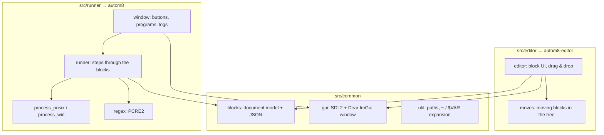

The window is drawn with `SDL_Renderer` (Direct3D on Windows, OpenGL / Vulkan / software on
Linux), so it also works on machines without a usable OpenGL driver.

</details>

## Linux vs Windows

Sequences work the same on both, with these differences:

| | Linux | Windows |
|---|---|---|
| *shell* option of Run | `sh -c` | `cmd /c` |
| "Ask to quit" (graceful kill) | SIGTERM to the program's process group | closes the program's windows (a program without windows can only be killed hard) |
| Killing a program | kills its process group | kills its job (everything it started) |
| Process patterns search | `/proc/*/cmdline` | every process's command line |

A sequence that runs Linux commands won't work on Windows as-is, and the other way around.
